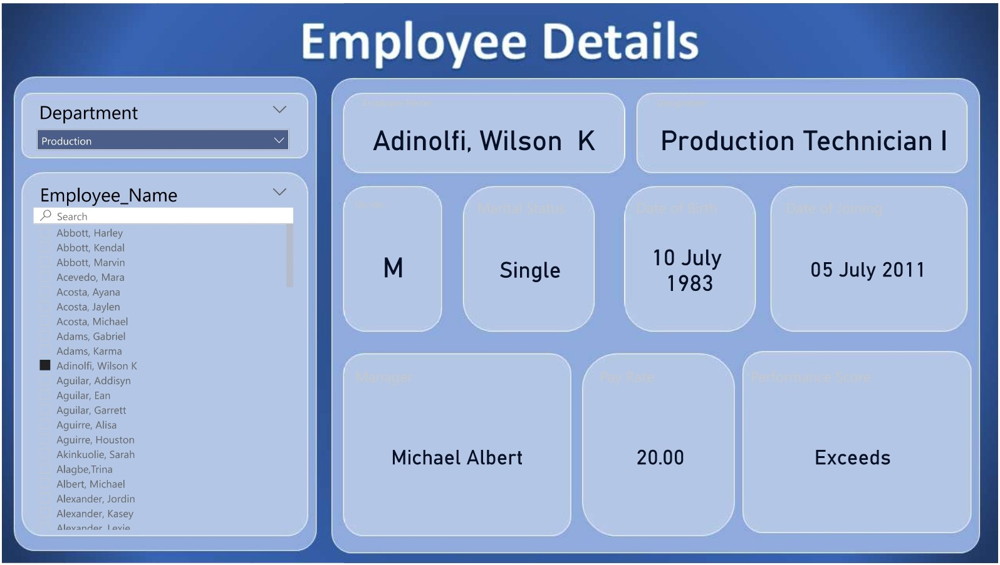
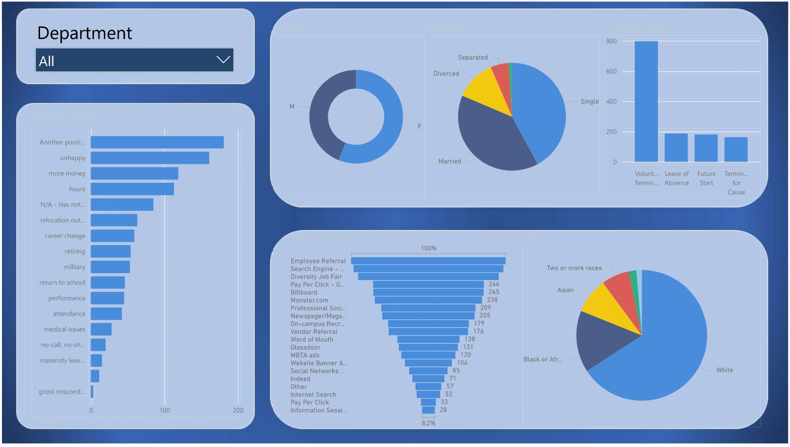

# HR Analytics Dashboard (Power BI)

An interactive two-page Power BI dashboard built to analyze a company's workforce — covering demographics, attrition/termination patterns, recruitment sources, and individual employee profiles.

---

## 📊 Project Overview

This project explores an HR employee dataset to surface insights around workforce composition, employee turnover, and recruitment effectiveness. It combines high-level visual analytics with a searchable employee lookup tool, making it useful for both strategic HR reporting and day-to-day employee record lookups.

**Tools used:** Power BI Desktop, DAX, Power Query (Data Modeling & Transformation)

---

## 🖥️ Dashboard Pages

### 1. HR Analytics Overview
A demographic and attrition-focused view of the entire workforce, filterable by Department.

**Includes:**
- **Department slicer** for filtering all visuals on the page
- **Gender split** (donut chart)
- **Marital Status breakdown** (pie chart)
- **Employment Status** — voluntary terminations, leave of absence, future starts, and terminations for cause (column chart)
- **Termination Reasons** ranked by frequency (bar chart) — top drivers include "another position," "unhappy," and "more money"
- **Race/Ethnicity distribution** (pie chart)
- **Recruitment Source** ranking (funnel chart) — Employee Referral leads as the top hiring channel

### 2. Employee Details
A searchable employee profile page for quick individual lookups.

**Includes:**
- **Department slicer** and a **searchable Employee Name list**
- Employee profile cards showing **Name, Designation, Gender, Marital Status, Date of Birth, Date of Joining, Manager, Pay Rate, and Performance Score**

---

## 🔍 Key Insights

- **Employee Referral** is by far the most effective recruitment channel, suggesting referral programs are worth continued investment.
- The most common stated reasons for leaving are **career-related** (seeking another position, dissatisfaction, and compensation) rather than personal/medical reasons.
- The workforce is predominantly **Single**, with Married employees forming the next largest group.
- Gender distribution is reasonably balanced across the organization.

---

## 📁 Repository Contents

| File | Description |
|------|-------------|
| `HR_Dashboard.pbix` | Power BI project file (open in Power BI Desktop) |
| `01_overview_dashboard.jpg` | Screenshot — HR Analytics Overview page |
| `02_employee_details.jpg` | Screenshot — Employee Details page |

---

## 🚀 How to Use

1. Download `HR_Dashboard.pbix`
2. Open the file in **Power BI Desktop** (free download from Microsoft)
3. Use the **Department** slicer to filter the overview page
4. Switch to the **Employee Details** page and search for an employee by name to view their full profile

---

## 🔧 Potential Future Improvements

- Add top-level KPI cards (Total Headcount, Attrition Rate, Average Tenure, Average Pay Rate)
- Add a time-based trend chart for hires vs. terminations over time
- Replace the funnel chart with a horizontal bar chart for recruitment source clarity

---

## 👤 Author

Created as part of a data analytics portfolio project.
